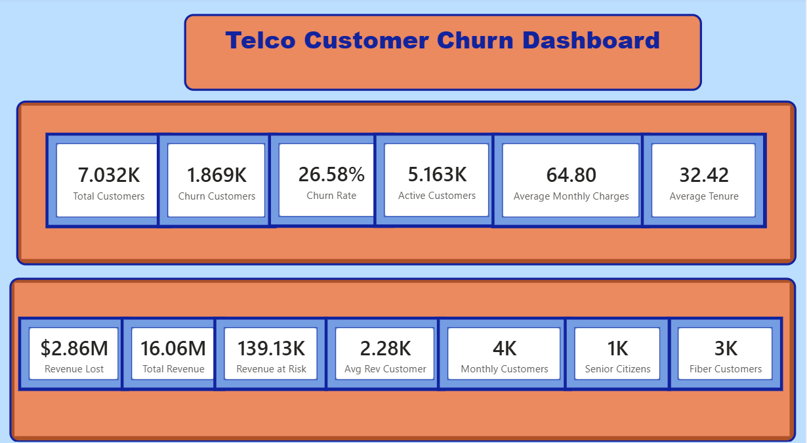
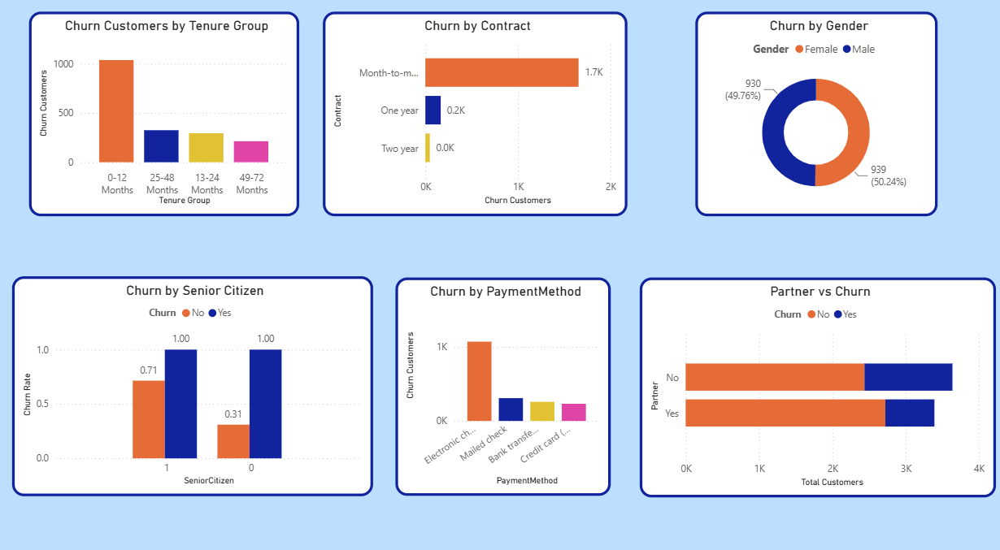
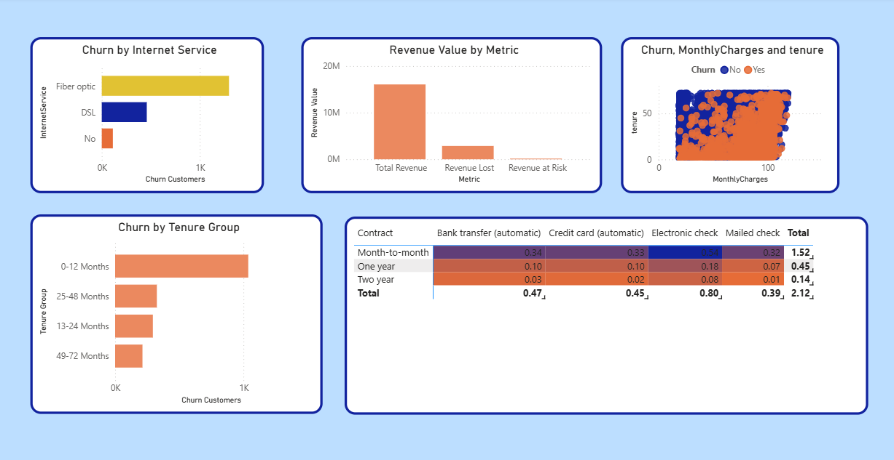

# 📊 Telco Customer Churn Analysis

## 📌 Project Overview

Customer churn is a major challenge for telecom companies because losing existing customers can reduce recurring revenue and increase customer acquisition costs.

This project analyzes the **IBM Telco Customer Churn dataset** using Microsoft Power BI to identify key churn patterns, understand high-risk customer segments, measure potential revenue impact, and develop data-driven customer retention recommendations.

The project combines **data transformation, DAX calculations, business analysis, dashboard development, and analytical storytelling** to convert raw customer data into actionable business insights.

---

## 🎯 Business Problem

The telecom company is experiencing customer churn, resulting in:

- Loss of recurring revenue
- Increased customer acquisition costs
- Reduced customer lifetime value
- Difficulty identifying customers most likely to leave

### Key Business Question

> **Which customer segments are most likely to churn, and what actions can reduce churn while protecting revenue?**

---

## 🎯 Project Objectives

The analysis was designed to:

- Identify the major drivers of customer churn
- Analyze customer behaviour across demographics, services, contracts, and tenure
- Identify high-risk customer segments
- Measure the potential financial impact of churn
- Develop actionable customer retention recommendations
- Build an interactive Power BI dashboard for decision-making

---

## 🗂️ Dataset Overview

The analysis uses the **IBM Telco Customer Churn dataset**.

**Dataset Size:** 7,043 customers  
**Variables:** 21  
**Target Variable:** Customer Churn (Yes/No)

The dataset contains information related to:

- Customer demographics
- Contract type
- Internet and phone services
- Tech support and online security
- Payment methods
- Monthly charges
- Total charges
- Customer tenure
- Churn status

---

## 🛠️ Tools & Technologies

- **Microsoft Power BI** – Dashboard development and visualization
- **Power Query** – Data cleaning and transformation
- **DAX** – KPI and business metric calculations
- **Microsoft Excel** – Data inspection and supporting analysis
- **Microsoft PowerPoint** – Business case presentation

---

# 📊 Dashboard Preview

## Executive Dashboard

The executive dashboard provides a high-level overview of customer churn and its potential business impact.

### Key KPIs

- **Total Customers:** 7.03K
- **Churn Customers:** 1.87K
- **Churn Rate:** 26.58%
- **Active Customers:** 5.16K
- **Average Monthly Charges:** 64.80
- **Average Tenure:** 32.42 months
- **Revenue at Risk:** ~139K

---

## Customer Churn Analysis

This dashboard analyzes churn across customer characteristics including:

- Contract type
- Customer tenure
- Gender
- Senior citizen status
- Payment method
- Partner status

---

## Customer Insights Dashboard

This dashboard provides additional analysis of customer behaviour, service adoption, and financial patterns to help identify customer groups requiring greater retention focus.

---

# 🔍 Key Findings

### 1. Month-to-Month Customers Show the Highest Churn

Customers using **month-to-month contracts** demonstrate substantially higher churn compared with customers on longer-term contracts.

### 2. Churn Is Concentrated Among Newer Customers

Customers within approximately their **first 12 months** represent an important churn-risk segment, highlighting the importance of early customer engagement.

### 3. Certain Customer Segments Show Higher Churn Risk

The analysis indicates relatively higher churn among:

- Senior citizens
- Customers without partners
- Customers using certain payment methods

These groups may benefit from more targeted retention strategies.

### 4. Revenue Exposure Is Significant

Approximately **139K in revenue is associated with customers currently identified within the churn population**, highlighting the financial importance of customer retention.

### 5. Service Adoption Can Support Retention

Value-added services such as **Tech Support and Online Security** provide opportunities to strengthen customer engagement and potentially improve long-term retention.

---

# 💡 Business Recommendations

Based on the analysis, the following actions are recommended:

### 1. Promote Long-Term Contracts

Encourage month-to-month customers to move toward annual or multi-year contracts through:

- Loyalty incentives
- Bundled offers
- Contract discounts

### 2. Improve First-Year Customer Experience

Strengthen engagement during the first 12 months through:

- Improved onboarding
- Proactive customer communication
- Early satisfaction monitoring
- Personalized retention offers

### 3. Target High-Risk Customer Segments

Develop targeted retention campaigns for customer groups demonstrating relatively higher churn.

### 4. Prioritize High-Value Customers

Monitor customers with significant revenue contribution and apply proactive retention strategies before churn occurs.

### 5. Promote Value-Added Services

Increase adoption of services such as:

- Tech Support
- Online Security
- Bundled service packages

These initiatives can potentially strengthen customer engagement and loyalty.

---

# 🔄 Project Methodology

The project followed the analytical workflow:

**Data Collection → Data Cleaning → Data Transformation → DAX Measures → Dashboard Development → Business Analysis → Recommendations**

### Data Preparation

Using Power Query:

- Reviewed data quality
- Handled missing/blank values
- Corrected data types
- Prepared variables for analysis

### Analysis & Dashboard Development

Using Power BI and DAX:

- Created KPI measures
- Analyzed churn across customer segments
- Evaluated revenue exposure
- Developed interactive dashboards
- Converted analytical findings into business recommendations

---

# 📁 Repository Contents

| File | Description |
|------|-------------|
| `Telco_Customer_Churn_Dashboard.pbix` | Complete interactive Power BI dashboard |
| `Telco_Customer_Churn_Analysis.pptx` | Business case presentation and analysis |
| `Executive_Dashboard.png` | Executive dashboard preview |
| `Customer_Churn_Analysis.png` | Customer churn analysis dashboard |
| `Customer_Insights_Dashboard.png` | Customer insights dashboard |

---

# 💼 Skills Demonstrated

This project demonstrates practical experience in:

- Business Analysis
- Data Analysis
- Customer Churn Analysis
- Data Cleaning & Transformation
- Power BI Dashboard Development
- Power Query
- DAX
- KPI Development
- Customer Segmentation
- Business Insight Generation
- Data Visualization
- Analytical Storytelling
- Business Recommendations

---

## 📌 Project Outcome

The project demonstrates how customer data can be transformed into actionable business insights using Power BI.

The analysis identified high-risk customer segments, quantified churn-related revenue exposure, and translated analytical findings into targeted retention recommendations to support data-driven business decision-making.

---

### 👤 Author

**Kaartik Chugh**

MBA Candidate | Insurance Operations | Aspiring Business & Data Analyst
